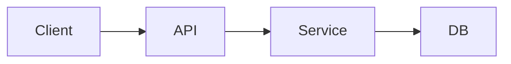

# Code Documentation

Use when asked to document a codebase, write a README, or produce reference/wiki
docs. Good docs come from reading the actual source, not guessing — accuracy
beats volume.

## Steps

### 1. Understand the code first

Map the repo before writing a word (see codebase-inspection): purpose, layout,
entry points, build/test commands, key modules, external deps.
```
run_terminal: "cd /home/user/repo && find . -maxdepth 2 -type d -not -path '*/node_modules/*' -not -path '*/.git/*'"
read_sandbox_file: package.json | pyproject.toml | etc.   # real commands
run_terminal: "rg -n 'def main|if __name__|export default|app.listen'"   # entry points
```
Read the primary modules with `read_sandbox_file`. For a large repo, delegate
sub-area summaries to `spawn_subagent` and fold them in.

### 2. Pick the right doc type

- **README** — what it is, why, install, quickstart, usage example, config,
  contributing. The 80% case.
- **API/reference** — per-module/function: signature, params, returns, errors,
  example. Generate from the actual signatures you read.
- **Architecture/wiki** — components, data flow, design decisions, diagrams
  (Mermaid in Markdown).

### 3. Write to the sandbox

Author Markdown with `write_sandbox_file`. A solid README skeleton:
```markdown
# Project Name
One-paragraph description: what it does and who it's for.

## Features
- Bullet the real capabilities you confirmed in the source.

## Installation
\`\`\`bash
<the real install command from the manifest>
\`\`\`

## Quickstart
\`\`\`bash
<the real run command>
\`\`\`
Minimal working example with expected output.

## Configuration
Table of env vars / options actually read by the code (rg 'process.env|os.environ').

## Project structure
Brief tree with one line per important dir.

## Development
Build, test, lint commands (the real ones).

## License
```
For multi-page docs, write a `docs/` tree:
```
manage_sandbox_files: mkdir /home/user/repo/docs
write_sandbox_file: docs/architecture.md, docs/api.md, ...
```

### 4. Use real, verified examples

Every code example and command must be real. Test commands you put in the docs:
```
run_terminal: "<the install/run/test command from the README>"
```
If a command fails, fix the doc — don't ship instructions that don't work. Pull
function signatures directly from source so params/return types are accurate.

### 5. Diagrams when they help

Embed Mermaid for architecture/flow:
````markdown

````

## Gotchas

- Don't document aspirational behavior — only what the code actually does.
- Keep examples copy-pasteable and runnable.
- Match the project's tone and existing doc style if any exist.
- Don't over-document trivial code; focus on what a new user/contributor needs.

## Deliver

Write the docs into the repo (e.g. `/home/user/repo/README.md`) and return a
`get_sandbox_file_url` link so the user can download the file(s). Summarize what
you documented and any commands you verified.
